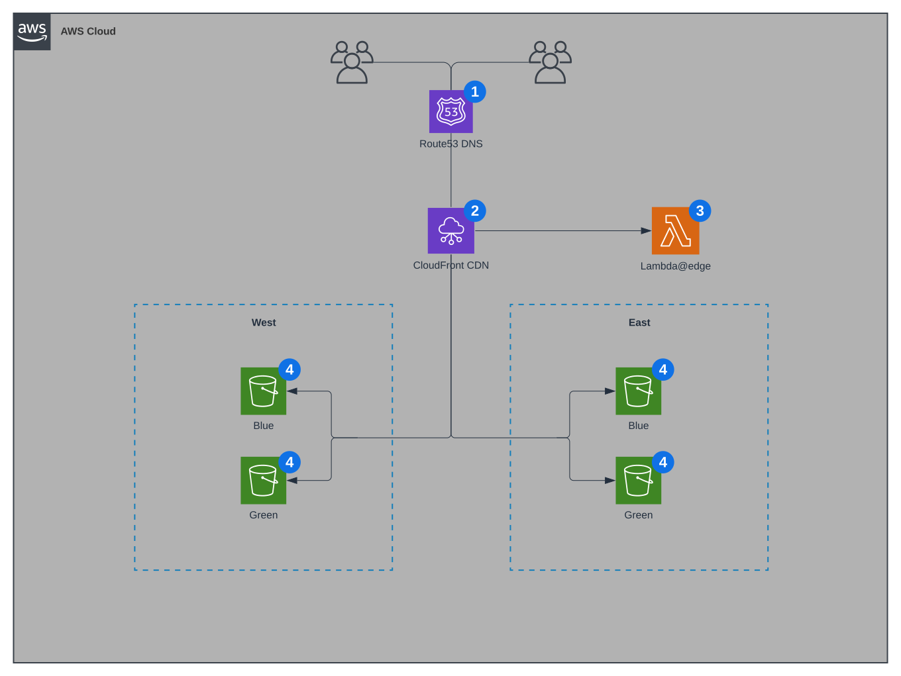

<div id="top"></div>

<!--
*** Comments prefixed with "TODO" will provide further instructions for
*** customizing certain parts of this README file.
-->

# {{name}}

<div align="center">
  <a href="https://github.com/{{org}}/{{repo}}">
    
  </a>

  <p align="center">
    <br />
    {{description}}
    <!-- TODO: Delete lines 33–46 -->
    <br />
    <br />
    <blockquote>
      ⚠️ NOTE: This README file is templatized and does not include information
      about how to use this repository template.
    </blockquote>
    <br />
  </p>
  <a href="https://reactjs.org/">
    
  </a>
  <a href="https://www.typescriptlang.org/">
    
  </a>
  <a href="https://webpack.js.org/">
    
  </a>
  <br />
  
  
  
	
  <br />
  <p align="center">
    <br />
    <a href="https://{{subdomain}}.{{hostname}}">
      
    </a>
    <a href="https://www.github.com/{{org}}/{{repo}}">
      
    </a>
    <a href="https://www.github.com/{{org}}/{{repo}}">
      
    </a>
    <br />
  </p>
  <p align="center">
    <br />
    <a href="#1-overview">Overview</a>
    ·
    <a href="#2-getting-started">Getting Started</a>
    ·
    <a href="#3-development">Development</a>
    ·
    <a href="#4-testing">Testing</a>
    ·
    <a href="#5-deplpoyment">Deployment</a>
    ·
    <a href="#6-Versioning">Releases</a>
  </p>
  <!--
  *** TODO: Take a screenshot of the product and replace the PNG file referenced
  *** below. This section is optional if this service is a monaxial service
  *** which only exposes remotes.
  -->
  <br />
  
</div>

## §1: Overview

This project includes the following features:

**Accessibility**

- [ ] Accessibility testing
- [ ] WCAG compliance

**Architecture**

- [ ] Framework agnosticism (WebComponents)
- [ ] Module Federation (micro-frontend architecture)
- [X] Zero-trust architecture

**Design**

- [x] Atomic Design principles
- [X] Design tokens
- [x] Mobile-first styling
- [X] Responsive layouts
- [ ] View Transitions API

**Deployment**

- [X] Artifact-based deployment
- [ ] Trunk-based deployment
- [X] Environmental and regional bypasses

**Development**

- [ ] Automated scaffolding
- [X] ESLint/Stylelint editor integration (VSCode, Webstorm/IntelliJ)
- [X] Component-driven UI Library
- [X] Just-In-Time CSS compilation
- [X] Centralized build pipeline
- [ ] Plug'n'play
- [X] Intrinsic CI/CD pipeline
- [X] Strong type-checking

**Infrastructure**

- [X] Bucket versioning
- [X] Managed services
- [ ] Multi-regional redundancy
- [X] Zero-downtime deployment strategy (e.g. blue/green, canary)

**Performance**

- [X] Code splitting
- [X] Edge caching
- [X] Lazy-loading
- [ ] Static/Server-side Rendering
- [X] Web Vitals

**Project Management**

- [X] Clean commit history
- [ ] Demoable PRs
- [ ] Issue template
- [X] Pull request template
- [X] Semantically versioned releases

**Testing**

- [ ] Enforced coverage thresholds (80% functional)
- [X] Unit/integration testing (Jest, @testing-library/react)
- [ ] Snapshot testing
- [X] Visual regression testing (Playwrite)
- [ ] Coverage reporting

<p align="right"><a href="#top">⬆️ back to top</a></p>

## §2: Getting Started

Follow these steps to get the project up and running on your local machine:

### 1. Prerequisites

- Node v16+
- NPM v8+

### 2. Installation

```bash
git clone git@github.com:{{org}}/{{repo}}
cd {{repo}}
npm run setup
```

### 3. Editor Configuration

For VSCode, save the following as `editor.code-workspace` in the project root
directory:

```json
{
  "folders": [
    {
      "path": "."
    }
  ],
  "settings": {
    "editor.rulers": [
     80,
     120
    ],
    "eslint.nodeEnv": "development",
    "files.autoSave": "onFocusChange",
    "yaml.format.enable": true,
    "yaml.format.singleQuote": true,
  },
}
```

<p align="right"><a href="#top">⬆️ back to top</a></p>

## §3: Development

### NPM Commands

- `npm run build`: Create a production build artifact.
- `npm run e2e`: Perform end-to-end testing with Cypress.
- `npm run format`: Perform static analysis and auto-fix errors.
- `npm run prod`: Serve the app in production mode.
- `npm run reset`: Perform a full `node_modules/` reset.
- `npm run setup`: Set up the project for development.
- `npm start`: Serve the app in development mode.
- `npm stop`: Kill any process running at port 8080.
- `npm test`: Execute the Jest test suite.

### Environment Variables

#### App

| Variable           | Required | Description                                                                                                |
|--------------------|----------|------------------------------------------------------------------------------------------------------------|
| **`APP_NAME`**     | Yes      | The name of this service. Used as the namespace for exposed remotes, as well as for logging and rendering. |
| `APP_DEBUG`        | No       | Print extra information to the browser console to debug redundant re-rendering issues.[^1]                 |
| **`APP_ENDPOINT`** | Yes      | Used as the base URL for fetching data from the backend. Add more env variables below.                     |

#### Build

| Variable          | Required | Description                                                                                                          |
|-------------------|----------|----------------------------------------------------------------------------------------------------------------------|
| `HOST`            | No       | The host used by Webpack Dev Server to serve the application for local development. Default host is `localhost`.[^2] |
| `PORT`            | No       | The port used by Webpack Dev Server to serve the application for local development. Default port is `8080`.          |
| `PUBLIC_PATH`     | No       | Used by Wepback Dev Server to retrieve chunks from the chunk graph.                                                  |
| `ANALYZE_BUNDLE`  | No       | Set to `true` to enable [`webpack-bundle-analyzer`](https://www.npmjs.com/package/webpack-bundle-analyzer).          |
| `SERVE_FROM_DISK` | No       | Set to `true` to write to disk when running Webpack Dev Server.                                                      |

[^1]: `NODE_ENV` must also be `development`, meaning this works when the app is
  run with `npm start` but not `npm run prod`.
[^2]: In order to run cypress tests in Firefox, set this var to `127.0.0.1`
  locally.

<p align="right"><a href="#top">⬆️ back to top</a></p>

## §4: Testing

This project uses multiple tiers of testing:

- **Unit & Integration Tests**: Use `npm run test` to run all tests.
- **End-To-End Tests**: Use `npm run e2e` to run Cypress tests.

These commands accept additional inputs following a `--` modifier as in the
common use-case examples below:

- `npm run test -- --watch`: Watch for changes and re-run all tests.
- `npm run test -- src/path/to/test.spec.ts`: Run tests in a specific test file.

To troubleshoot Cypress tests locally, run the Cypress GUI:

```bash
cypress open -C test/e2e/cypress.config.js
```

To troubleshoot Cypress in the CI/CD pipeline, set the following variable in the
appropriate Github Actions workflow file:

```yaml
e2e-debug=true 
```

Alternatively, you can set the environment variable `CI_DEBUG_E2E` to `true` if
you don't have an open PR.

[^9]: `npm run prod` is recommended to achieve the best results when running
  end-to-end tests.

<p align="right"><a href="#top">⬆️ back to top</a></p>

## §5: Deployment

To deploy the application to a production environment, follow these steps once
your PR is merged:

- 1. Get the latest changes from the release branch

```bash
git checkout main && git pull
```

- 2. Create a new version tag

```bash
git tag <version> && git push origin <version>
```

This will create a new deployment that you can monitor by vising the _Actions_
tab in Github.

### Environments

- `DEV`: Used for manual testing and low-fidelity product demos
- `QA`: Used for UAT and high-fidelity product demos
- `PROD`: The live production environment used by external users

### Regions

- **East**: North Virginia (`us-east-1`)
- **West**: Oregon (`us-west-2`)

### Releases

This project uses [SemVer](http://semver.org/) for versioning. For the versions
available, see the [tags on this repository](https://github.com/{{org}}/{{repo}}/tags).

Major versions should have a corresponding release in Github. Click [here](https://github.com/{{org}}/{{repo}}/releases/new)
to create a new release once your version meets acceptance criteria.

<p align="right"><a href="#top">⬆️ back to top</a></p>

## §6: Infrastructure



<p align="right"><a href="#top">⬆️ back to top</a></p>

## §7: Contact

For inquiries and additional information, please reach out to:

**Rob Hameetman**  
_Front End Architect_ | Chicago, IL  
engineering@robhameetman.com

<p align="right"><a href="#top">⬆️ back to top</a></p>

## §8: License

Distributed under the MIT License.  
See the [LICENSE](LICENSE) file for details.

<p align="right"><a href="#top">⬆️ back to top</a></p>
